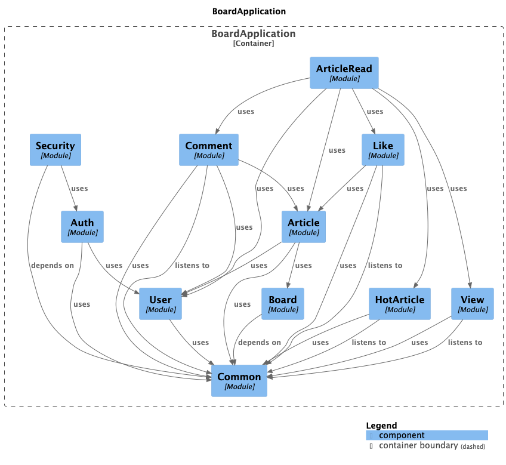

# 📘 게시판 서비스: 모놀리틱 아키텍처에서부터 마이크로서비스 아키텍처까지
---

## 📖 소개

이 프로젝트는 모놀리틱 아키텍처 기반의 게시판 서비스에서 출발해, 마이크로서비스 아키텍처로 점진적 분리가 가능하도록 설계되었습니다.

핵심 기능은 다음과 같습니다:

- 회원가입 / 로그인 / 로그아웃 / 토큰 재발급
- 회원 조회 / 수정
- 게시판 목록 조회
- 게시글 등록 / 조회 / 수정 / 삭제
- 게시글 좋아요 생성 / 삭제
- 댓글, 대댓글 생성 / 삭제

부가적인 기능은 다음과 같습니다:

- 커서 기반 페이징 지원
- 공통 Response 적용
- REST API + REST Docs 문서화
- Testcontainers 기반 통합 테스트 환경 구성
- 게시글 조회 수 어뷰징 방지
- 캐시 적용
- 비동기 처리 적용
- Spring Modulith 적용

## 💻 기술 스택

### 🛠️ BackEnd

**Language & Framework**


**Build Tool**


**Database**


**Containerization**


**Monitoring**


## 📎 API 문서

- 문서 경로: src/main/resources/static/docs/index.html
- 테스트 시 자동 생성 (build/docs/asciidoc/index.html)

## 🚀 실행 방법

```bash
# 1. Gradle 빌드
./gradlew build

# 2. Docker로 MySQL 띄우기 (docker-compose 사용 시)
docker-compose up -d

# 3. 앱 실행
./gradlew bootRun
```

## 🧪 테스트 및 문서화

- 단위 테스트: JUnit 5 + Mockito
- 통합 테스트: Testcontainers + Spring Boot
- API 문서화: Spring REST Docs + Asciidoctor
- 기타: @ActiveProfiles("test")로 테스트 전용 설정 분리

> API 테스트 시 스니펫이 자동 생성되고, Asciidoctor로 HTML 문서화됩니다.

## 📂 폴더 구조

```text
board.backend/
├── article/                       # [모듈] 게시글 모듈
│   ├── application/               # 비즈니스 로직 (Reader/Writer 등 유스케이스)
│   │   └── port/                  # 인터페이스
│   ├── domain/                    # 도메인 엔티티, VO, 도메인 정책
│   ├── infra/                     # DB, 외부 API, 라이브러리 연동
│   │   ├── jpa/
│   │   └── redis/
│   └── web/                       # REST Controller (Request, Response 포함)
│       ├── request/
│       └── response/
├── articleRead/                   # [모듈] 게시글 읽기 전용 모듈 (게시글 모듈과 동일한 구조)
│
├── comment/                       # [모듈] 댓글 모듈 (게시글 모듈과 동일한 구조)
│   └── ...
│
├── like/                          # [모듈] 좋아요 모듈 (게시글 모듈과 동일한 구조)
│   └── ...
│
├── user/                          # [모듈] 회원 모듈 (게시글 모듈과 동일한 구조)
│   └── ...
│
├── view/                          # [모듈] 조회 모듈 (게시글 모듈과 동일한 구조)
│   └── ...
│
├── common/                        # [공통 코드]
│   ├── event/                     # 이벤트
│   ├── support/                   # 공통 유틸, 예외, 인터페이스 등
│   ├── infra/                     # 외부 Config 등
│   └── web/                       # 공통 응답 포맷, security
│       └── response/
└── security/
```

## 📎 모듈 의존성

